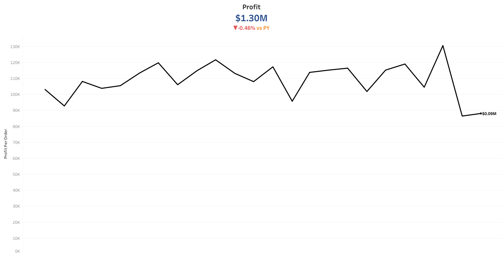

# PROJECT DETAILS

* `Guide`: [Data Tutorials](https://www.youtube.com/watch?v=oAIubTqg-Kw&list=PLO9LeSU_vHCU_DHaLzEvsLxFdmB3Qcao_&index=1)
* `Data`: Employees of a company.
* `Note`: The visuals below are dashboard elements so the axis, legends, ... are not included. Click on the [link]() to this workbook and feel free to fiddle around.

## Result
### Employee Count

   </img>

* Review

### Profit

   </img>

* `Review`
  -  The profit was interesting because after a rise, there was a decline.
  - Profit and sales didn't share the same trend as there were months when sales increased but profit decreased. I speculate that this business have many variable costs or they are new to online platform or a new business so it would need more money to operate in the first few years. Business domain is still new and foreign to me so please leave a feedback if you can.
  
### Order Quantity

   </img>

* `Review`
  - There was a huge rise in order quantiy from January/2017 to October/2017, but this didn't correlate with sales or profit.
  - I wonder what events led to the fall of sales, profit and order quantity in November/2017.

### Market Share by Sales

   </img>

* Review
  - Sales mainly came from LATAM and Europe, which took up more than 75% of total sales.
  - Then Pacific Asia came in third and the last is Africa.
  - Keep focusing on LATAM and Europe would be a more sensible choice while expanding business to Pacific Asia and Africa would require more data and further analysis.

### Category wise Year to Date sales versus Previous Year

   </img>

* Review
  - I can see there could be a transition in customers' interest: 
    - In the top 9 categories, 6 of them had a decrease in sales than previous year and 5 out of 6 declined more than 24%.
    - `Camping & Hiking` and `Water Sports` ranked third and fourth in 2017 with a significant rise than previous year.
  - Using this insight, business could increase stocks or promote products related to outdoor activities or sports.
  - It is a positive sign that `Computers` made it into the top 9 so the business should keep an eye on this category.

### Market wise Customer Aquisition per Month

   </img>

